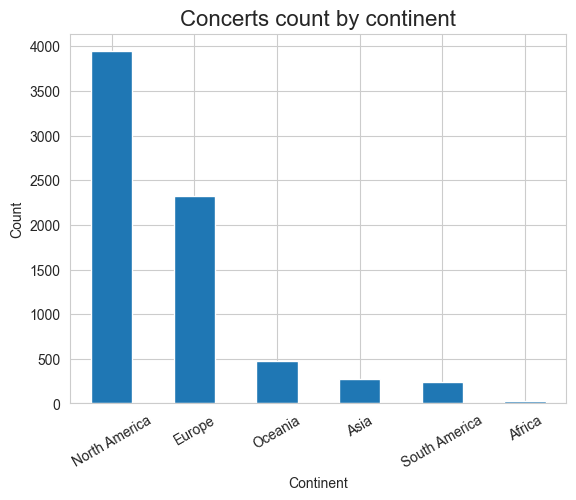
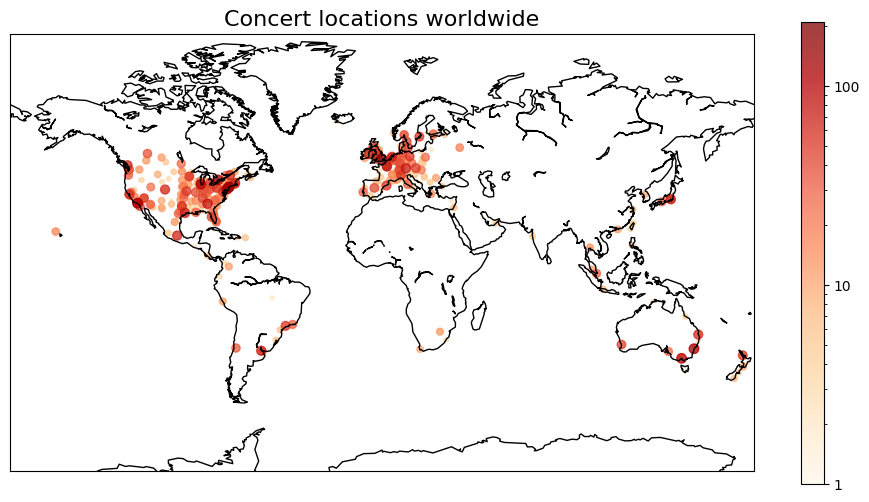
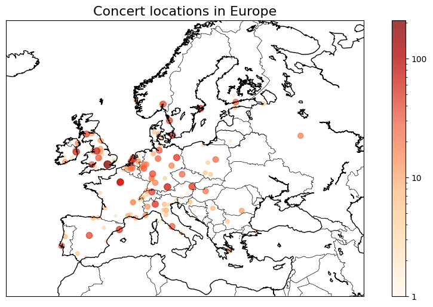
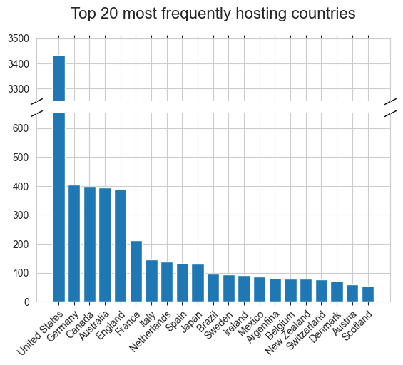

# What does 'World' in 'World tour' phrase really means?

Scrolling the Internet you can often see complaining (that actually became a [meme](https://www.reddit.com/r/memes/comments/r1rwx8/world_tour/) as this point) about world tours that skip a lot of countries and entire continents. It intuitively feels like truth, but I wanted to gather data and find a proof of it.

To achieve this, I gathered data regarding biggest music world tours in history and I analysed location of all concerts.

## Data source

I've used Wikipedia as my data source. I decided to analyse tours that I found in few tables coming from two articles:
- [List of most attended concert tours](https://en.wikipedia.org/wiki/List_of_most-attended_concert_tours)
    - Table [Tours attended by 5 million people or more](https://en.wikipedia.org/wiki/List_of_most-attended_concert_tours#Over_5_million_attendance) 
    - Table [Tours attended by 3.5 to 4.9 million people](https://en.wikipedia.org/wiki/List_of_most-attended_concert_tours#3.5–4.9_million_attendance)

- [List of highest-grossing concert tours](https://en.wikipedia.org/wiki/List_of_highest-grossing_concert_tours)
    - Table [Top 20 highest-grossing tours of all time](https://en.wikipedia.org/wiki/List_of_highest-grossing_concert_tours#Timeline_of_the_highest-grossing_tour)
    - Table [Timeline of the highest-grossing tour record](https://en.wikipedia.org/wiki/List_of_highest-grossing_concert_tours#Timeline_of_the_highest-grossing_tour)

If you want to see how I scraped and transformed data, you should check out [this notebook](https://www.youtube.com/watch?v=dQw4w9WgXcQ) from my repo.

Some tours from those lists are still going on. Therefore I have to say that data was scraped on 21 Nov 2023.

### Initial analysis

After transforming and cleaning my dataset I gathered first informations. First of all, I found out that I have 7281 concerts coming from 49 concert tours. 
These were performed on all (populated) continents, in 604 unique cities across 79 countries. At this point we can already see, that much more than 100 countries never hosted any concert from those biggest tours.

After checking value counts of concert location by continent I could get my first conclusions:
- More than a half of concerts took part in North America.
- Very small fractions of those events took part in Africa. There is only 29 of them, making 0.4% of dataset.
- Australia and Oceania hosted a lot of examined concerts, regarding population of this continent.

## Map visualization

They say that a picture is worth a thousand words, so I think that most important thing is to plot location of concerts on map. Bigger size and darker color of marker means that more concerts were held in that place.

In few countries (I'd say USA, Canada, Australia) [it looks like a population density map](https://xkcd.com/1138/). It's not the case for the rest of world. Globally we can already see that South America, Africa and Asia held very little of world tours events. You can see also some disproportions in Europe. Concerts there concentrate in UK, Germany, France, Northern Italy and Benelux countries. Southern and Eastern Europe and even Spain and Portugal seem to be hosts of world tours concerts much less often.

> [!info]
> PLACEHOLDER FOR INTERACTIVE PLOT

## Further analysis

Those map visualizations are actually enough to know what does 'world' means in 'world tour' phrase. But if you're interested more, then there is more deep dive analysis.

### Concerts by country
Then I plotted 20 countries that most frequently hosted concerts from my dataset. The only one, but kinda big, suprise was how disproportional is number of concerts that were located in United States than in any other country.

We can also see, that 4 out of 5 countries are (mostly) English speaking. It may be important factor, considering that most famous artist usually sing in English.

Next step was examining countries in individual continents. I decided to not plot this, because data distributions are very skewed, so plots aren't really readable here.

First, looking at Oceania we can see that there are actually only Australia and New Zeleand. It's not very suprising, considering than other countries there are small islands with small population. Still, count of concerts in those two countries is very high regarding their population.

| Country     |   Count |
|:------------|--------:|
| Australia   |     395 |
| New Zealand |      79 |

In Africa we can see, that almost all concerts took place in South Africa Republic. Individual events were held in Tunisia and Marocco
| Country     |   Count |
|:-------------|--------:|
| South Africa |      27 |
| Morocco      |       1 |
| Tunisia      |       1 |

South America seems to be probably least suprising continent. I would personally expect that more world tour concerts held in Uruguay. It's obviously small country, but according to [this data](https://www.imf.org/external/datamapper/NGDPDPC@WEO/OEMDC/ADVEC/WEOWORLD) it has also the biggest GDP per capita in this continent.

| Country   |   Count |
|:----------|--------:|
| Brazil    |      96 |
| Argentina |      81 |
| Chile     |      33 |
| Colombia  |      14 |
| Peru      |      11 |
| Ecuador   |       3 |
| Uruguay   |       2 |
| Paraguay  |       1 |

In North America there is a big disproportion between United States and other countries, but we already know this. Canada seem to be similar case to Australia and New Zeland - english speaking country with very good economy. 

| Country            |   Count |
|:-------------------|--------:|
| United States      |    3435 |
| Canada             |     398 |
| Mexico             |      88 |
| Costa Rica         |       8 |
| Puerto Rico        |       6 |
| Dominican Republic |       3 |
| Guatemala          |       2 |
| Panama             |       1 |
| El Salvador        |       1 |
| Honduras           |       1 |

In Asia we have another very skewed distribution. Majority of concerts is held in Japan. Suprisingly large count is for Singapur - another english-speaking, wealthy country. I would also assumed that South Korea gets much more events than it actually has.

|  Country     | Count  |  Country               | Count  |
|--------------|--------|------------------------|--------|
|  Japan       | 132    |  United Arab Emirates  | 7      |
|  Singapore   | 34     |  Indonesia             | 7      |
|  Taiwan      | 14     |  Israel                | 7      |
|  Thailand    | 13     |  China                 | 7      |
|  Philippines | 12     |  India                 | 6      |
|  Malaysia    | 11     |  Macau                 | 4      |
|  Hong Kong   | 10     |  Bahrain               | 1      |
|  South Korea | 10     |  Brunei                | 1      |

In the Europe we have the most unique countries, that were hosting world tour shows. However, more than 1/3 of them hosted not more than 10 such events. Countries with the biggest count of concerts are localised in western and central part of Europe. Eastern and southern Europe gets much less of those.

| Country     | Count | Country        | Count | Country          | Count | Country            | Count |
|-------------|------:|----------------|------:|------------------|------:|------------------------|---|
| Germany     |   405 | Denmark        |    71 | Hungary          |    21 | Monaco                 | 3 |
| England     |   390 | Austria        |    60 | Greece           |    16 | Montenegro             | 2 |
| France      |   212 | Scotland       |    54 | Northern Ireland |    15 | Lithuania              | 2 |
| Italy       |   146 | Norway         |    51 | Romania          |    11 | Cyprus                 | 2 |
| Netherlands |   139 | Poland         |    43 | Croatia          |     8 | Luxembourg             | 2 |
| Spain       |   133 | Portugal       |    38 | Estonia          |     7 | Bosnia and Herzegovina | 1 |
| Sweden      |    95 | Finland        |    34 | Serbia           |     7 | Latvia                 | 1 |
| Ireland     |    92 | Wales          |    33 | Turkey           |     5 | Slovenia               | 1 |
| Belgium     |    80 | Czech Republic |    28 | Bulgaria         |     5 | Malta                  | 1 |
| Switzerland |    77 | Russia         |    23 | Iceland          |     3 | Slovakia               | 1 |

### World tours distribution
According to data, only 4 out of 49 examined tours had events hosted on all continents. 15 out of 49 were hosted on not more than 3 continents, with so-called ['The Garth Brooks World Tour (2014–2017)'](https://en.wikipedia.org/wiki/The_Garth_Brooks_World_Tour_(2014–2017)) with world being US and Canada.

Ed Sheeran during his [÷ Tour](https://en.wikipedia.org/wiki/÷_Tour) visited 49 countries. It's the biggest number of visited countries during one tour in my dataset. Needless to say, that it was one of all-continents tour.

# Final conclusions
The popular meme is true. It really seems that in dictionary of world-famous artists world means mostly US, Canada, Western Europe and sometimes Australia and Japan. It doesn't really suprise me, but is good to have evidence for that.

What's more suprising is how big is difference between United States and any other country. Among the most interesting things I found out here, is also large count of concerts held in Australia, Canada and New Zeleand in comparison to population of that places.

It also seem to be universal key for the most common countries - they tend to be very wealthy (rather obvious) and english-speaking (now it also seem obvious, but it wasn't like this before) countries. We need to have in mind that almost all of those artists sing in english and come from UK or USA.

# Links
- [Code repository]()
- [List of highest-grossing concert tours](https://en.wikipedia.org/wiki/List_of_highest-grossing_concert_tours)
- [List of most attended concert tours](https://en.wikipedia.org/wiki/List_of_most-attended_concert_tours)
- [How to broke y-axis using matplotlib](https://matplotlib.org/stable/gallery/subplots_axes_and_figures/broken_axis.html)

